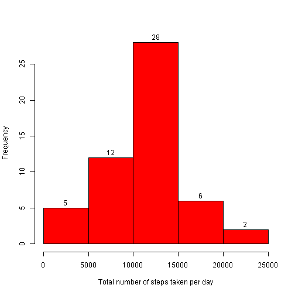

Report for Peer Assessment 1
========================================================

**Load Data**


```r
    rawData<-read.csv("activity.csv",colClasses = c("numeric", "Date", "numeric"))
```

**Distribution of total number of steps taken per day based on raw data**

```r
    sumRawData<-aggregate(steps~date,FUN=sum,data=rawData)

    hist(sumRawData$steps,main="",col = "red", xlab = "Total number of steps taken per day",labels=T)
```

 

**Mean total number of steps taken per day based on raw data**

```r
    mean(sumRawData$steps)
```

```
## [1] 10766
```
**Median total number of steps taken per day based on raw data**

```r
    median(sumRawData$steps)
```

```
## [1] 10765
```

**Average daily activity pattern based on raw data**

```r
    avgRawData<-aggregate(steps~interval,FUN=mean,data=rawData)
    
    plot(avgRawData$interval,avgRawData$steps,type="l",col="red",
    xlab="Interval",ylab="Average Steps Taken")
```

 

**Identifying time interval with maximum number of steps**

```r
    avgRawData$interval[max(avgRawData$steps)]
```

```
## [1] 1705
```


**Total number of rows with steps=NA**

```r
    length(rawData$steps[rawData$steps=="NA"])
```

```
## [1] 2304
```

**Filling in the missing values in the dataset with mean value for each 5-minute interval**

```r
    newData<-merge(rawData,avgRawData,by="interval")
    names(newData)<-c("interval","steps","date","avgSteps")

    newData$steps[is.na(newData$steps)==T]<-newData$avgSteps[is.na(newData$steps)==T]
    newData$avgSteps<-NULL
```
**Distribution of total number of steps taken per day after imputing missing values**


```r
    sumNewData<-aggregate(steps~date,FUN=sum,data=newData)
    hist(sumNewData$steps,main="",col = "red", xlab = "Total number of steps taken per day",labels=T)
```

 

**Mean total number of steps taken per day after imputing missing values**

```r
    mean(sumNewData$steps)
```

```
## [1] 10766
```
**Median total number of steps taken per day after imputing missing values**

```r
    median(sumNewData$steps)
```

```
## [1] 10766
```
***Since missing data are filled by the mean value of the corresponding 5-minute interval, the mean value is the same as that of the raw data, and the median value is very close to that of the raw data.***

**Differences in activity patterns between weekdays and weekends**

```r
    Sys.setlocale("LC_TIME", "English")
```

```
## [1] "English_United States.1252"
```

```r
    newData$DayofWeek<-ifelse(weekdays(newData$date) %in% c("Sunday","Saturday"),"weekend","weekday")
    newData$DayofWeek<-as.factor(newData$DayofWeek)
    avgNewData<-aggregate(steps~interval+DayofWeek,FUN=mean,data=newData)
    
    par(mfrow=c(2,1))
    plot(avgNewData$interval[avgNewData$DayofWeek=="weekday"],
         avgNewData$steps[avgNewData$DayofWeek=="weekday"],type="l",col="red",
         xlab="Interval",ylab="Average Steps Taken",main="Weekday")
    plot(avgNewData$interval[avgNewData$DayofWeek=="weekend"],
         avgNewData$steps[avgNewData$DayofWeek=="weekend"],type="l",col="red",
         xlab="Interval",ylab="Average Steps Taken",main="Weekend")
```

 
